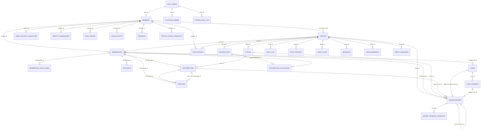
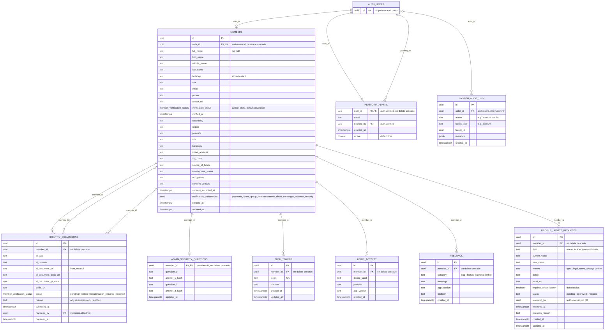
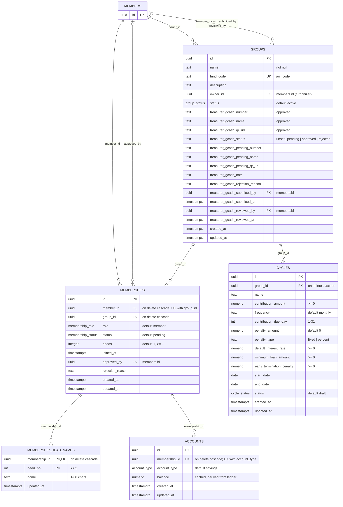
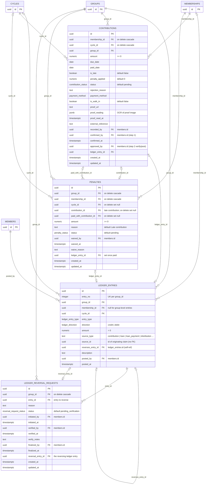
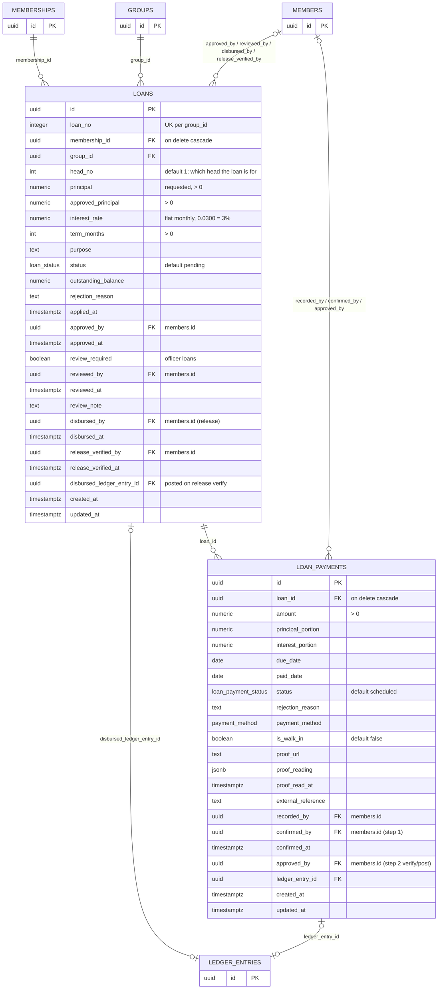
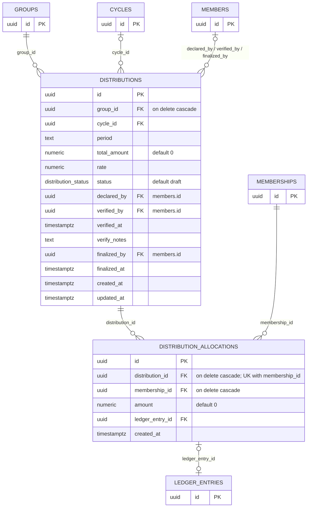
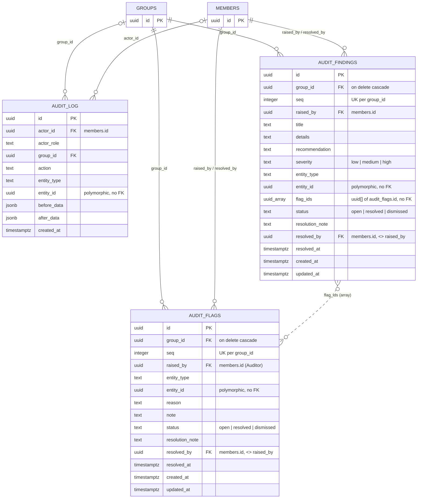
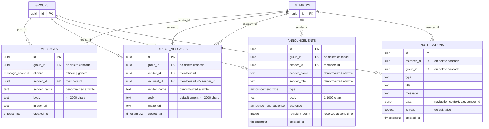

# KapitPondo — Entity Relationship Diagram

> Source of truth: `supabase/migrations/` (17 files, one per area — see `supabase/README.md`). PostgreSQL / Supabase.
>
> Diagrams use Mermaid `erDiagram` syntax and render on GitHub, GitLab, and VS Code (with a Mermaid preview extension).

---

## Contents

1. [Conventions](#1-conventions)
2. [Overview diagram](#2-overview-diagram)
3. [Domain diagrams (full columns)](#3-domain-diagrams-full-columns)
   - 3.1 [Identity & platform](#31-identity--platform)
   - 3.2 [Groups & membership](#32-groups--membership)
   - 3.3 [Ledger, contributions & penalties](#33-ledger-contributions--penalties)
   - 3.4 [Lending](#34-lending)
   - 3.5 [Distributions](#35-distributions)
   - 3.6 [Oversight & auditing](#36-oversight--auditing)
   - 3.7 [Communication](#37-communication)
4. [Enum types](#4-enum-types)
5. [Relationship reference](#5-relationship-reference)
6. [Polymorphic & soft references (no FK)](#6-polymorphic--soft-references-no-fk)
7. [Constraints & business rules enforced in the database](#7-constraints--business-rules-enforced-in-the-database)
8. [Indexes](#8-indexes)
9. [Table inventory](#9-table-inventory)

---

## 1. Conventions

| Convention | Meaning |
|---|---|
| `id uuid` | Every table (except the 4 noted in §9) has a `uuid` primary key defaulting to `gen_random_uuid()`. |
| `numeric` | Money is always `numeric(14,2)`; rates are `numeric(6,4)` (e.g. `0.0300` = 3%). Never floating point. |
| `created_at` / `updated_at` | `timestamptz`, default `now()`. `updated_at` is maintained by the `set_updated_at()` trigger. |
| **PK / FK / UK** | Primary key / foreign key / unique key (in diagrams). |
| Actor columns | Columns such as `recorded_by`, `approved_by`, `confirmed_by`, `verified_by` reference `members.id` and record *who* performed a workflow step. |
| Role names | The DB role `owner` is shown as **Organizer** in the app UI. |

**Two-layer money model.** Claim tables (`contributions`, `loan_payments`, `loans`, `distribution_allocations`, `penalties`) carry the workflow, proof, and actors. `ledger_entries` is the **append-only** ledger — a row is written only when a claim is fully verified, and it can never be updated or deleted (triggers). Corrections are made with reversing entries via `ledger_reversal_requests`.

---

## 2. Overview diagram

Entities and their structural relationships only. Actor FKs to `members` (who approved/recorded/verified) are omitted here for readability — see §5.

---

## 3. Domain diagrams (full columns)

Tables that belong to another domain appear with only the columns needed to show the link.

### 3.1 Identity & platform

### 3.2 Groups & membership

### 3.3 Ledger, contributions & penalties

### 3.4 Lending

### 3.5 Distributions

### 3.6 Oversight & auditing

### 3.7 Communication

---

## 4. Enum types

| Enum | Values | Used by |
|---|---|---|
| `member_verification_status` | `unverified`, `pending`, `verified`, `resubmission_required` (UI: Requires Re-submission), `rejected` (final) | `members.verification_status` |
| `group_status` | `active`, `archived` | `groups.status` |
| `membership_role` | `owner` (UI: Organizer), `treasurer`, `auditor`, `member` | `memberships.role` |
| `membership_status` | `pending`, `active`, `suspended`, `exited`, `rejected` | `memberships.status` |
| `cycle_status` | `draft`, `active`, `closed` | `cycles.status` |
| `account_type` | `savings`, `share_capital` | `accounts.account_type` |
| `ledger_direction` | `credit` (into fund/member), `debit` (out) | `ledger_entries.direction` |
| `ledger_entry_type` | `contribution`, `loan_disbursement`, `loan_repayment`, `distribution`, `expense`*, `penalty`, `fee`, `adjustment`, `reversal` | `ledger_entries.entry_type` |
| `payment_method` | `gcash`, `cash`, `bank_transfer`, `other` | `contributions`, `loan_payments` |
| `contribution_status` | `pending`, `submitted`, `confirmed`, `approved`, `rejected`, `late` | `contributions.status` |
| `loan_status` | `pending`, `approved`, `active`, `paid`, `rejected`, `defaulted`, `cancelled` | `loans.status` |
| `loan_payment_status` | `scheduled`, `submitted`, `confirmed`, `approved`, `paid`, `late`, `partial`, `rejected` | `loan_payments.status` |
| `distribution_status` | `draft`, `previewed`, `verified`, `finalized` | `distributions.status` |
| `penalty_status` | `pending`, `waived`, `paid` | `penalties.status` |
| `reversal_request_status` | `pending_verification`, `verified`, `rejected`, `finalized` | `ledger_reversal_requests.status` |
| `message_channel` | `officers`, `general` | `messages.channel` |
| `announcement_type` | `reminder`, `meeting`, `cycle`, `urgent` | `announcements.type` |
| `announcement_audience` | `all`, `unpaid`, `officers` | `announcements.audience` |

\* `expense` is kept only because reporting still sums it; nothing posts it any more (the expense feature was removed).

**Text columns with CHECK-constrained values** (not enums): `groups.treasurer_gcash_status`, `feedback.category`, `profile_update_requests.field / reason / status`, `audit_findings.severity / status`, `audit_flags.status`. `cycles.penalty_type` (`fixed` | `percent`) and `cycles.frequency` are free text by convention only.

---

## 5. Relationship reference

Every foreign key in the schema. **Card.** = cardinality from parent to child. **On delete** is `no action` unless stated.

### Structural relationships

| Child table | Column | → Parent | Card. | On delete |
|---|---|---|---|---|
| members | auth_id | auth.users.id | 1 : 0..1 | cascade |
| platform_admins | user_id | auth.users.id | 1 : 0..1 | cascade |
| platform_admins | granted_by | auth.users.id | 1 : N | — |
| system_audit_log | actor_id | auth.users.id | 1 : N | — |
| admin_security_questions | member_id | members.id | 1 : 0..1 | cascade |
| identity_submissions | member_id | members.id | 1 : N | cascade |
| push_tokens | member_id | members.id | 1 : N | cascade |
| login_activity | member_id | members.id | 1 : N | cascade |
| feedback | member_id | members.id | 1 : N | cascade |
| profile_update_requests | member_id | members.id | 1 : N | cascade |
| groups | owner_id | members.id | 1 : N | — |
| memberships | member_id | members.id | 1 : N | cascade |
| memberships | group_id | groups.id | 1 : N | cascade |
| membership_head_names | membership_id | memberships.id | 1 : N | cascade |
| cycles | group_id | groups.id | 1 : N | cascade |
| accounts | membership_id | memberships.id | 1 : N (one per type) | cascade |
| ledger_entries | group_id | groups.id | 1 : N | — |
| ledger_entries | membership_id | memberships.id | 0..1 : N | — |
| ledger_entries | cycle_id | cycles.id | 0..1 : N | — |
| ledger_entries | reverses_entry_id | ledger_entries.id | 0..1 : 0..1 | — |
| contributions | membership_id | memberships.id | 1 : N | cascade |
| contributions | cycle_id | cycles.id | 1 : N | cascade |
| contributions | group_id | groups.id | 1 : N | — |
| contributions | ledger_entry_id | ledger_entries.id | 0..1 : 0..1 | — |
| penalties | group_id | groups.id | 1 : N | cascade |
| penalties | membership_id | memberships.id | 1 : N | cascade |
| penalties | cycle_id | cycles.id | 0..1 : N | set null |
| penalties | contribution_id | contributions.id | 0..1 : 0..1 (partial unique) | set null |
| penalties | paid_with_contribution_id | contributions.id | 0..1 : N | set null |
| penalties | ledger_entry_id | ledger_entries.id | 0..1 : 0..1 | — |
| ledger_reversal_requests | group_id | groups.id | 1 : N | cascade |
| ledger_reversal_requests | entry_id | ledger_entries.id | 1 : N | — |
| ledger_reversal_requests | reversal_entry_id | ledger_entries.id | 0..1 : 0..1 | — |
| loans | membership_id | memberships.id | 1 : N | cascade |
| loans | group_id | groups.id | 1 : N | — |
| loans | disbursed_ledger_entry_id | ledger_entries.id | 0..1 : 0..1 | — |
| loan_payments | loan_id | loans.id | 1 : N | cascade |
| loan_payments | ledger_entry_id | ledger_entries.id | 0..1 : 0..1 | — |
| distributions | group_id | groups.id | 1 : N | cascade |
| distributions | cycle_id | cycles.id | 0..1 : N | — |
| distribution_allocations | distribution_id | distributions.id | 1 : N | cascade |
| distribution_allocations | membership_id | memberships.id | 1 : N | cascade |
| distribution_allocations | ledger_entry_id | ledger_entries.id | 0..1 : 0..1 | — |
| audit_log | group_id | groups.id | 0..1 : N | — |
| audit_findings | group_id | groups.id | 1 : N | cascade |
| audit_flags | group_id | groups.id | 1 : N | cascade |
| messages | group_id | groups.id | 1 : N | cascade |
| direct_messages | group_id | groups.id | 1 : N | cascade |
| announcements | group_id | groups.id | 1 : N | cascade |
| notifications | member_id | members.id | 0..1 : N | cascade |
| notifications | group_id | groups.id | 0..1 : N | cascade |

### Actor relationships (all → `members.id`, nullable unless noted, no cascade)

| Table | Actor columns |
|---|---|
| identity_submissions | `reviewed_by` |
| groups | `treasurer_gcash_submitted_by`, `treasurer_gcash_reviewed_by` |
| memberships | `approved_by` |
| ledger_entries | `posted_by` (**not null**) |
| contributions | `recorded_by`, `confirmed_by`, `approved_by` |
| penalties | `waived_by` |
| ledger_reversal_requests | `initiated_by` (**not null**), `verified_by`, `finalized_by` |
| loans | `approved_by`, `reviewed_by`, `disbursed_by`, `release_verified_by` |
| loan_payments | `recorded_by`, `confirmed_by`, `approved_by` |
| distributions | `declared_by`, `verified_by`, `finalized_by` |
| audit_log | `actor_id` |
| audit_findings | `raised_by` (**not null**), `resolved_by` |
| audit_flags | `raised_by` (**not null**), `resolved_by` |
| messages | `sender_id` (**not null**) |
| direct_messages | `sender_id`, `recipient_id` (both **not null**) |
| announcements | `sender_id` (**not null**) |

---

## 6. Polymorphic & soft references (no FK)

These columns point at other rows but are **not** enforced by a foreign key.

| Table.column | Points to | Notes |
|---|---|---|
| `ledger_entries.source_type` + `source_id` | The claim row that produced the entry (`contributions`, `loans`, `loan_payments`, `distribution_allocations`, `penalties`) | Reverse direction of the claim's `ledger_entry_id`. |
| `audit_log.entity_type` + `entity_id` | Any group-level entity | Before/after snapshots in `before_data` / `after_data`. |
| `audit_flags.entity_type` + `entity_id` | The flagged record (contribution, loan, ledger entry, …) | Indexed on `entity_id`. |
| `audit_findings.entity_type` + `entity_id` | Optional subject of the finding | |
| `audit_findings.flag_ids` | `audit_flags.id[]` | Flags rolled up into a finding. |
| `system_audit_log.target_type` + `target_id` | Usually the affected auth user | |
| `profile_update_requests.reviewed_by` | `auth.users.id` of the sysadmin | Deliberately not `members.id` — sysadmins are identified by auth id. |
| `messages.sender_name`, `direct_messages.sender_name`, `announcements.sender_name/sender_role` | Snapshot of `members.full_name` / role | Denormalized so realtime payloads render without a join; history is not rewritten on rename. |

---

## 7. Constraints & business rules enforced in the database

### Uniqueness

| Rule | Mechanism |
|---|---|
| A member joins a group at most once | `memberships UNIQUE (member_id, group_id)` |
| One active cycle per group | partial unique index `one_active_cycle_per_group ON cycles(group_id) WHERE status='active'` |
| One account per type per membership | `accounts UNIQUE (membership_id, account_type)` |
| One allocation per member per distribution | `distribution_allocations UNIQUE (distribution_id, membership_id)` |
| One open loan per head | partial unique `loans_one_open_per_head ON loans(membership_id, head_no) WHERE status IN ('pending','approved','active')` |
| One late contribution row per period | partial unique `uq_contributions_late_period ON contributions(membership_id, cycle_id, due_date) WHERE status='late'` |
| One penalty per contribution | partial unique `uq_penalties_contribution ON penalties(contribution_id) WHERE contribution_id IS NOT NULL` |
| Human-readable per-group numbers | `UNIQUE (group_id, entry_no)` on ledger_entries, `(group_id, loan_no)` on loans, `(group_id, seq)` on audit_findings and audit_flags |
| Group join code | `groups.fund_code UNIQUE` |
| Push token | `push_tokens.token UNIQUE` |

### Segregation of duties (CHECK)

| Constraint | Rule |
|---|---|
| `contrib_segregation` | `approved_by <> recorded_by` unless `is_walk_in` |
| `loanpay_segregation` | `approved_by <> recorded_by` |
| `audit_findings_not_self_resolved` | `resolved_by <> raised_by` |
| `audit_flags_not_self_resolved` | `resolved_by <> raised_by` |
| `dm_not_self` | `sender_id <> recipient_id` |

The fuller two-step rules (confirm → verify, who may do each step for each role, officer-loan review) live in the security-definer functions in `0011_fn_contributions.sql` and `0012_fn_lending.sql`, not in table constraints.

### Value checks

- Money: `amount > 0` on ledger_entries, loan_payments; `>= 0` on contributions, penalties, cycles.contribution_amount; `loans.principal > 0`, `approved_principal > 0`, `term_months > 0`.
- `memberships.heads >= 1`; `loans.head_no >= 1`; `membership_head_names.head_no >= 2`, `name` 1–80 chars.
- `cycles.contribution_due_day BETWEEN 1 AND 31`; `default_interest_rate`, `minimum_loan_amount`, `early_termination_penalty >= 0`.
- Chat: `messages` / `direct_messages` body ≤ 2000 chars and (non-blank body **or** `image_url`); `announcements` body non-blank and ≤ 1000 chars.

### Triggers

- `ledger_no_update`, `ledger_no_delete` on `ledger_entries` → `prevent_ledger_mutation()`; the ledger is append-only.
- `set_updated_at()` on every table with an `updated_at` column.

### Security (RLS)

- The API uses the service-role key; all writes to financial tables go through it (`0015_security.sql`).
- The mobile app reads tables for realtime refresh only, filtered by read-only RLS policies (`0015_security.sql`).

---

## 8. Indexes

Besides primary keys and the unique constraints above:

| Table | Index columns |
|---|---|
| memberships | `(member_id)`, `(group_id)` |
| cycles | `(group_id)` |
| accounts | `(membership_id)` |
| ledger_entries | `(group_id)`, `(membership_id)`, `(source_type, source_id)` |
| contributions | `(membership_id)`, `(cycle_id)`, `(status)` |
| loans | `(membership_id)`, `(status)` |
| loan_payments | `(loan_id)` |
| distribution_allocations | `(distribution_id)`, `(membership_id)` |
| penalties | `(group_id)`, `(membership_id)`, `(paid_with_contribution_id)` |
| ledger_reversal_requests | `(group_id)`, `(entry_id)` |
| audit_log | `(group_id)`, `(group_id, created_at desc)`, `(group_id, entity_type, created_at desc)` |
| audit_findings | `(group_id, status, created_at desc)` |
| audit_flags | `(group_id, status, created_at desc)`, `(entity_id)` |
| notifications | `(member_id)` |
| push_tokens | `(member_id)` |
| system_audit_log | `(created_at desc)` |
| messages | `(group_id, channel, created_at desc)` |
| direct_messages | `(group_id, least(sender_id, recipient_id), greatest(sender_id, recipient_id), created_at desc)` |
| announcements | `(group_id, created_at desc)` |
| login_activity | `(member_id, created_at desc)` |
| feedback | `(member_id, created_at desc)` |
| profile_update_requests | `(member_id, created_at desc)` |
| identity_submissions | `(member_id, submitted_at desc)`; partial unique `(member_id) WHERE status = 'pending'` |

---

## 9. Table inventory

29 application tables, plus Supabase's `auth.users`.

| # | Table | Domain | Primary key | Purpose | Defined in |
|---|---|---|---|---|---|
| 1 | members | Identity | `id` | Platform user account, personal/KYC profile and current verification status (1:1 with auth user) | `0002_identity` |
| 2 | identity_submissions | Identity | `id` | One row per ID submission and its review, so earlier attempts are kept | `0002_identity` |
| 3 | platform_admins | Identity | `user_id` | System administrators (by auth user) — the only source of admin access | `0002_identity` |
| 4 | system_audit_log | Identity | `id` | Sysadmin actions (account verify/reject, …) | `0002_identity` |
| 5 | admin_security_questions | Identity | `member_id` | Hashed recovery Q&A for admin accounts | `0002_identity` |
| 6 | push_tokens | Identity | `id` | Expo push tokens per device | `0002_identity` |
| 7 | login_activity | Identity | `id` | Sign-in history per device | `0002_identity` |
| 8 | feedback | Identity | `id` | In-app feedback submissions | `0002_identity` |
| 9 | profile_update_requests | Identity | `id` | Requests to change locked KYC fields, reviewed by sysadmin | `0002_identity` |
| 10 | groups | Groups | `id` | A cooperative fund; holds the approved Treasurer GCash details | `0003_groups` |
| 11 | memberships | Groups | `id` | Member ↔ group link with role, status, and number of heads | `0003_groups` |
| 12 | membership_head_names | Groups | `(membership_id, head_no)` | Display names for heads 2..n | `0003_groups` |
| 13 | cycles | Groups | `id` | Contribution cycle settings (amount, due day, penalty, loan defaults) | `0003_groups` |
| 14 | accounts | Groups | `id` | Cached per-membership balance, derived from the ledger | `0003_groups` |
| 15 | ledger_entries | Ledger | `id` | Append-only ledger; the financial source of truth | `0004_ledger` |
| 16 | contributions | Ledger | `id` | Contribution claims (GCash/bank with proof, walk-in cash) | `0004_ledger` |
| 17 | penalties | Ledger | `id` | Late-contribution penalties (pending / waived / paid) | `0004_ledger` |
| 18 | ledger_reversal_requests | Ledger | `id` | Reversal workflow: initiate → verify → finalize | `0004_ledger` |
| 19 | loans | Lending | `id` | Loan applications through approve → review → release → verify | `0005_lending` |
| 20 | loan_payments | Lending | `id` | Loan repayment claims (flat-rate principal/interest split) | `0005_lending` |
| 21 | distributions | Payouts | `id` | Dividend declarations: draft → preview → verify → finalize | `0006_distributions` |
| 22 | distribution_allocations | Payouts | `id` | Per-member share of a distribution | `0006_distributions` |
| 23 | audit_log | Oversight | `id` | Group-level activity trail with before/after snapshots | `0007_oversight` |
| 24 | audit_flags | Oversight | `id` | Auditor flags on specific records (numbered per group) | `0007_oversight` |
| 25 | audit_findings | Oversight | `id` | Formal audit findings with severity and recommendation | `0007_oversight` |
| 26 | notifications | Communication | `id` | In-app notifications (realtime + push) | `0008_communication` |
| 27 | messages | Communication | `id` | Group chat (officers / general channels) | `0008_communication` |
| 28 | direct_messages | Communication | `id` | 1-to-1 chat within a group | `0008_communication` |
| 29 | announcements | Communication | `id` | Organizer/officer broadcasts to an audience | `0008_communication` |

Tables whose primary key is not a standalone `id`: `platform_admins` (`user_id`), `admin_security_questions` (`member_id`), `membership_head_names` (composite).
